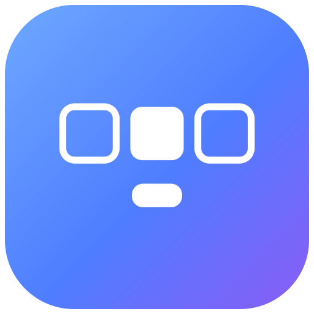
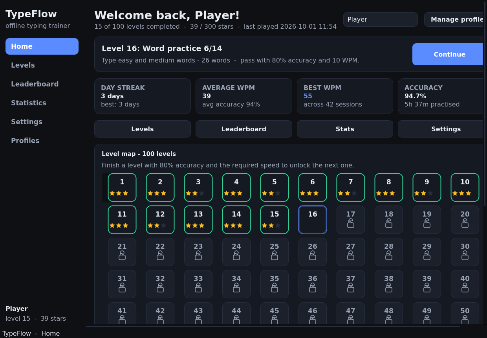
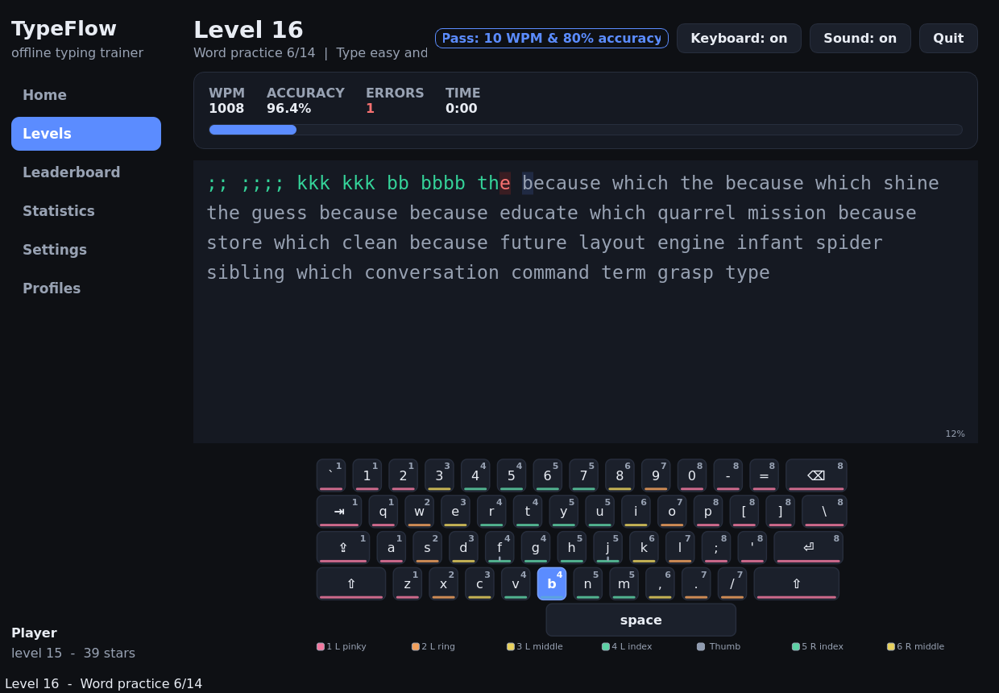
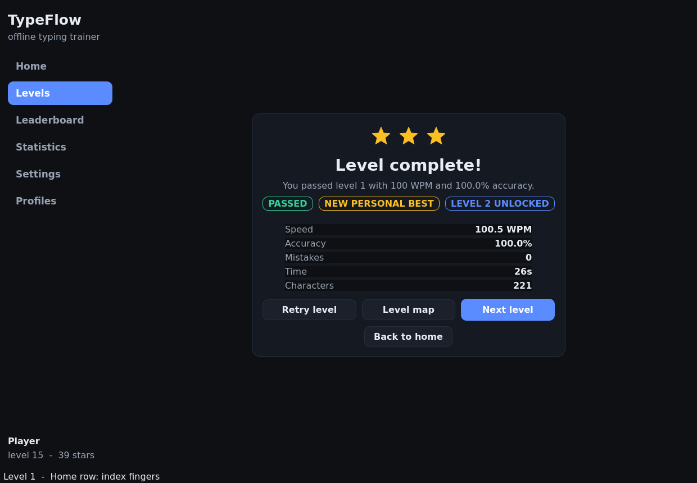
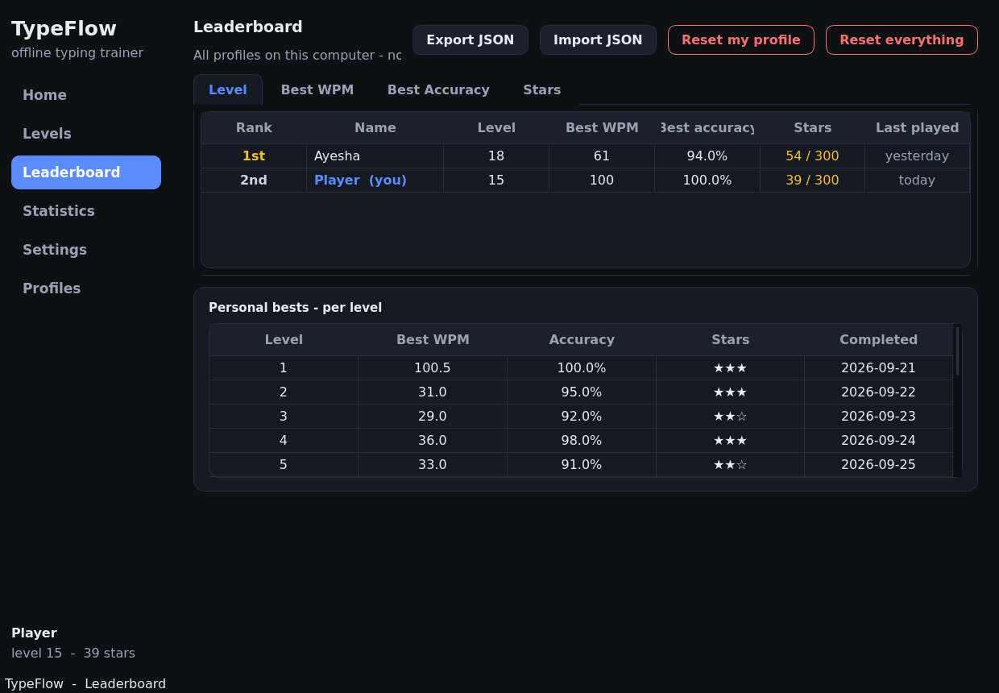
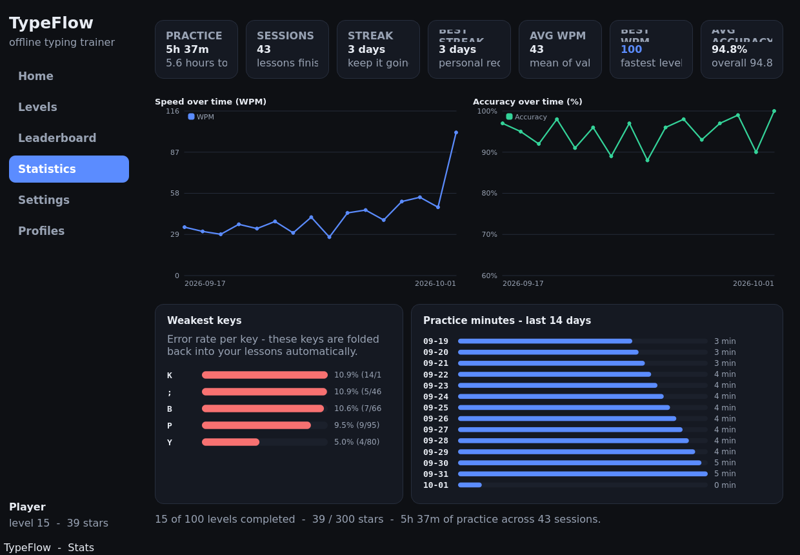
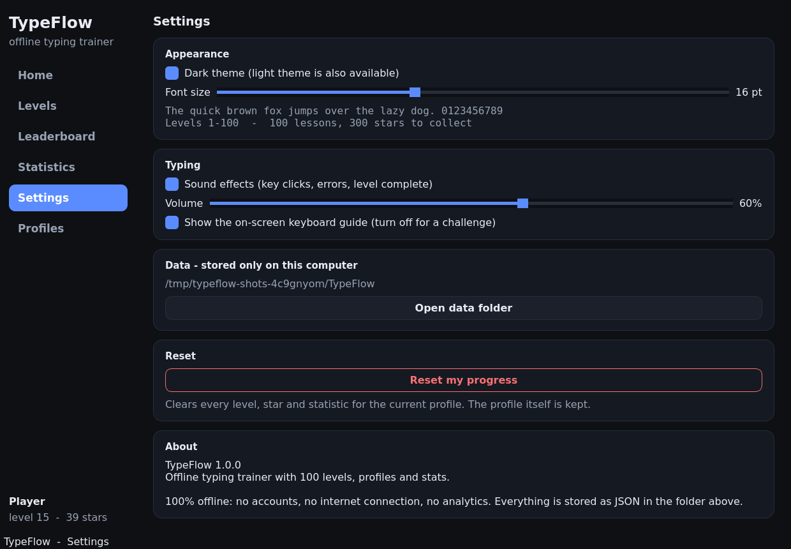
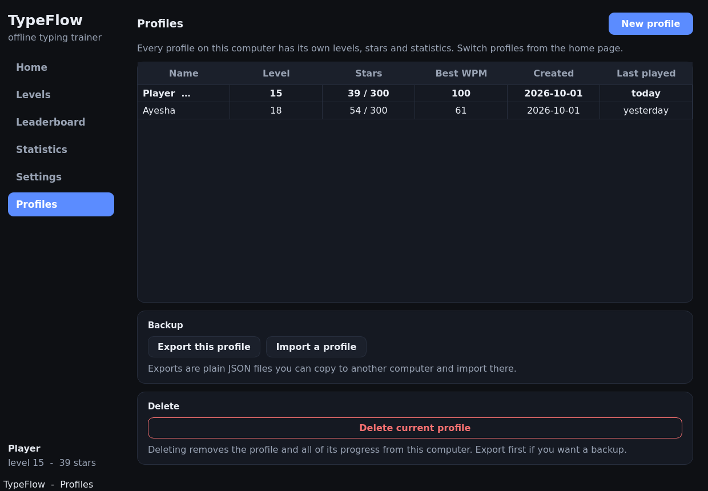
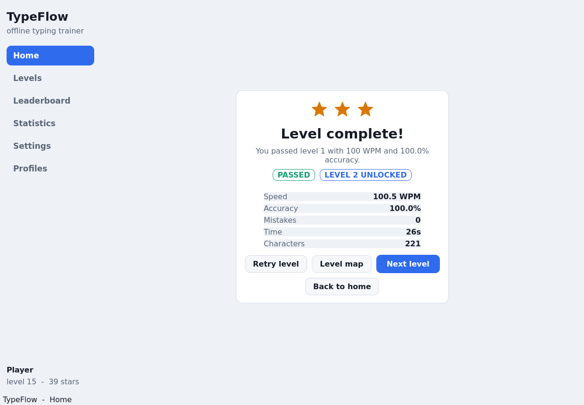

# TypeFlow ⌨️

**A fully offline desktop typing trainer built with Python + PyQt6.**

100 levels, multiple local profiles, per-key weakness tracking, a local
leaderboard and statistics — with **no internet connection, no accounts, no
API calls and no analytics**. Every byte of data lives on your own PC.



---

## Screenshots

| Home & level map | Typing screen |
| --- | --- |
|  |  |

| Results | Leaderboard |
| --- | --- |
|  |  |

| Statistics | Settings |
| --- | --- |
|  |  |

| Profiles | Light theme |
| --- | --- |
|  |  |

*Screenshots were generated headlessly with
`QT_QPA_PLATFORM=offscreen python tools/capture_screenshots.py`.*

---

## Features

### 100 % offline
* No network access of any kind — the app never opens a socket.
* All data is stored as plain JSON in your user data folder
  (`%APPDATA%\TypeFlow` on Windows, `~/.local/share/TypeFlow` on Linux,
  `~/Library/Application Support/TypeFlow` on macOS).
* Sound effects are **synthesised at first run** (the standard-library `wave`
  module), so the repository contains no binary audio assets.

### Home page
* Personal welcome, current profile name and a profile switcher.
* A big **Continue** button that jumps to the next unlocked level.
* The full **level map of 100 levels**: locked 🔒 / unlocked / completed with
  1–3 stars each.
* Quick stats: day streak, average WPM, best WPM, overall accuracy.
* Shortcuts to Levels, Leaderboard, Stats and Settings.

### Levels & progression
* **Levels 1–10** teach the keyboard row by row: home row, top row, bottom row,
  numbers, shift/capitals and punctuation.
* **Levels 11–100** move from single words to sentences to paragraphs with
  steadily rising difficulty.
* **Final tests** at levels 25, 50, 75 and 100 mix everything learned so far.
* A level is passed with **≥ 80 % accuracy** *and* a **minimum WPM that rises
  by 2 WPM every ten levels** (8 → 10 → 12 … 26 WPM).
* Every lesson is **~70 % new material + ~30 % review**, biased towards your
  weakest keys and words (spaced repetition).
* **1–3 stars** per level, **unlimited retries with no penalty**.
* Lesson content lives in one human-editable file:
  [`typing_app/data/lessons.json`](typing_app/data/lessons.json).

### Typing screen
* Live WPM, accuracy, error count, timer and progress bar.
* Correct characters are green, mistakes red, with a caret on the next letter.
* An **on-screen keyboard** that highlights the next key and colour-codes the
  correct finger (toggle it off in Settings for a real challenge).
* Sound effects with a volume control, and a results screen after every level.
* A **weak-key tracker** records the error rate of every key you press and
  feeds those keys back into future lessons.

### Profiles
* Create, switch between and delete multiple local profiles.
* Each profile has its own levels, stars, statistics and weak-key data.

### Local leaderboard
* Ranks every profile on this PC by **level, best WPM, best accuracy or total
  stars** (tabs).
* Shows rank, name, level, WPM, accuracy, stars and last-played date.
* 🥇🥈🥉 gold / silver / bronze for the top three, the current profile is
  highlighted and marked *(you)*.
* **Personal-best history per level.**
* Impossible results (e.g. over 300 WPM) are ignored.
* Reset one profile or the whole leaderboard — both with confirmation.
* **Export / import** progress and the leaderboard as JSON files.

### Statistics dashboard
* WPM and accuracy graphs over time, current/longest day streak, total practice
  time, session count and a bar chart of your **weakest keys**.

### Settings
* Sound on/off + volume, dark/light theme, font size, keyboard guide on/off,
  progress reset, data-folder location and an about box.

---

## Project structure

```
TypeFlow/
├── run.py                       # entry point:  python run.py
├── requirements.txt             # PyQt6 (that's the only runtime dependency)
├── build_exe.bat                # Windows .exe build (PyInstaller) for Releases
├── build_exe.sh                 # Linux/macOS build for development
├── LICENSE                      # MIT
├── README.md
├── assets/
│   ├── icon.ico / icon.png      # app icon (regenerate: assets/generate_icon.py)
│   └── generate_icon.py
├── docs/screenshots/            # screenshots used by this README
├── tools/
│   ├── generate_lessons.py      # regenerates typing_app/data/lessons.json
│   └── capture_screenshots.py   # renders the screenshots headlessly
├── tests/
│   ├── test_core.py             # 34 tests: engine, storage, leaderboard, UI
│   └── run_tests.py             # dependency-free runner
└── typing_app/                  # the application package
    ├── config.py                # paths, constants, default settings
    ├── storage.py               # atomic JSON storage (settings/profiles/progress)
    ├── level_engine.py          # 100 levels, unlock rules, stars, lesson generator
    ├── typing_engine.py         # character state machine + WPM/accuracy maths
    ├── stats.py                 # derived statistics (streaks, weak keys, series)
    ├── leaderboard.py           # local ranking + impossible-result filtering
    ├── audio.py                 # synthesises and plays the WAV sound effects
    ├── app.py                   # main window, navigation, controller
    ├── data/
    │   └── lessons.json         # ← EDIT THIS to change the practice content
    └── ui/                      # one module per screen + shared widgets
        ├── theme.py             # dark/light palettes + generated stylesheet
        ├── widgets.py           # cards, stat tiles, level map, dialogs
        ├── charts.py            # QPainter line/bar charts (no extra deps)
        ├── keyboard_view.py     # on-screen keyboard with finger colours
        ├── typing_text.py       # coloured character display with caret
        ├── home.py  levels_page.py  typing_page.py  results_page.py
        ├── leaderboard_page.py  stats_page.py  settings_page.py  profiles_page.py
```

---

## Install & run

Requires **Python 3.9 or newer**.

```bash
git clone https://github.com/<your-name>/TypeFlow.git
cd TypeFlow

python -m venv .venv
# Windows:  .venv\Scripts\activate
source .venv/bin/activate

pip install -r requirements.txt
python run.py
```

That's it — no configuration, no login, no network.

## Building the Windows .exe

```bat
build_exe.bat
```

The script creates a virtual environment, installs the dependencies and runs
PyInstaller to produce a single-file executable:

```
dist\TypeFlow.exe
```

Upload `dist\TypeFlow.exe` straight to a **GitHub Release**.  (Linux/macOS
developers can run `./build_exe.sh` to get `dist/TypeFlow`.)

The build bundles `lessons.json` and the icon, and explicitly imports
`PyQt6.QtMultimedia` so the sound effects are included.

## Running the tests

```bash
python tests/run_tests.py      # no dependencies needed
# or, if you have pytest:
python -m pytest tests -q
```

34 tests cover:

| Area | What is verified |
| --- | --- |
| Level locking | level 1 open, level 2 locked until level 1 is *completed*, failures do not unlock, pass thresholds (80 % + rising WPM) |
| Progress saving | profile/settings round-trips, survival across a simulated app restart, resets, deletes, corrupt-file tolerance |
| Leaderboard | ranking by all four metrics, ties share a rank, results over 300 WPM are ignored, medals, personal bests |
| Level engine | every one of the 100 levels generates text, min WPM rises every 10 levels, star thresholds, final tests, adaptive review uses weak keys/words and never harder material |
| Typing engine | perfect run = 100 %, mistakes tracked per key and per word, backspace |
| End-to-end UI | plays level 1 through the **real typing screen**, checks the results screen appears, level 2 unlocks, the save file on disk is correct, a sloppy attempt does **not** unlock anything, and the leaderboard ranks two profiles correctly |

## Where the data lives

| File | Contents |
| --- | --- |
| `settings.json` | theme, sound, volume, font size, keyboard guide, current profile |
| `profiles.json` | index of the local profiles |
| `profile_<id>.json` | one profile: levels, stars, history, weak keys, weak words |
| `sounds/*.wav` | generated on first run |

Use **Settings → Open data folder** to jump straight there.  Delete a profile
file (or use *Profiles → Delete*) to remove a player completely.

## Editing the lessons

`typing_app/data/lessons.json` is the single source of practice content:

```json
{
  "rows": { "home": "asdfghjkl;", "top": "qwertyuiop", "...": "..." },
  "words": { "easy": ["the", "and"], "medium": [], "hard": [] },
  "sentences": { "easy": [], "medium": [], "hard": [] },
  "paragraphs": { "medium": [], "hard": [] }
}
```

Add your own words, sentences or paragraphs, save, restart the app — the level
engine picks them up automatically.  `python tools/generate_lessons.py`
rebuilds the shipped file from the lists inside that script.

## Requirements

* Python 3.9+
* PyQt6 ≥ 6.4 (`pip install -r requirements.txt`)
* PyInstaller ≥ 6.0 — only for building the `.exe`

## License

[MIT](LICENSE) — free for personal and commercial use.
